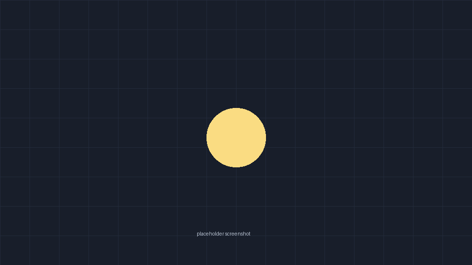
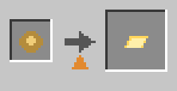
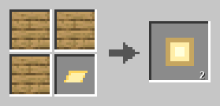
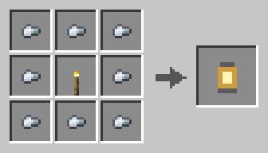
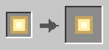
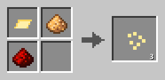

<!-- Generated by modpage from modpage.yml -- edit that file, not this one. -->

  

<i>Hand-placed lanterns that actually light the world.</i>

  
  
  
  
  
  

<b>Loaders:</b> Fabric, NeoForge &nbsp;•&nbsp; <b>Minecraft:</b> 1.21.1, 1.20.1 &nbsp;•&nbsp; <b>Side:</b> Client & Server

<a href="https://github.com/Matthijs/lantern-lights">GitHub</a> &nbsp;•&nbsp; <a href="https://modrinth.com/mod/lantern-lights">Modrinth</a> &nbsp;•&nbsp; <a href="https://www.curseforge.com/minecraft/mc-mods/lantern-lights">CurseForge</a> &nbsp;•&nbsp; <a href="https://github.com/Matthijs/lantern-lights/issues">Issues</a>

---

## Contents

- [About](#about)
- [Supported versions](#support)
- [Features](#features)
- [Gallery](#gallery)
- [Recipes](#recipes)
- [Dependencies](#dependencies)
- [Incompatibilities](#incompatibilities)
- [Installation](#installation)
- [Configuration](#configuration)
- [Changelog](#changelog)
- [FAQ](#faq)
- [Credits](#credits)

---

  

Lantern Lights replaces the vanilla lantern with a dynamic light source that
follows the block it is attached to, so corridors, mineshafts and boats stay
lit without a single command block.

It is a drop-in change: no new items, no world data, nothing to migrate.

---

  

| Minecraft | Loaders |
| --- | --- |
| 1.21.1 | Fabric, NeoForge |
| 1.20.1 | Fabric, NeoForge |

---

  

- **Dynamic lighting** — Lanterns emit light along the path they are carried.
- **Zero config required** — Sensible defaults out of the box; every value is tunable.
- **Server-side friendly, with client-only rendering**

---

  

  
   <i>A lit mineshaft, no torches placed</i>

---

  

Every recipe below is generated straight from the mod's data files.

<b>Show all recipes</b>

<table>
<tr>
<td align="center" width="33%"> Glow Ingot From Smelting <i>(Smelting)</i></td>
<td align="center" width="33%"> Glow Lantern From Planks</td>
<td align="center" width="33%"> Lantern</td>
</tr>
<tr>
<td align="center" width="33%"> Lantern Block Cut <i>(Stonecutting)</i></td>
<td align="center" width="33%"> Lantern Dust <i>(Shapeless)</i></td>
</tr>
</table>

---

  

**Required**

| Mod | Version | Notes |
| --- | --- | --- |
| [Fabric API](https://modrinth.com/mod/fabric-api) | >=0.100.0 | Fabric builds only |

**Optional**

| Mod | Version | Notes |
| --- | --- | --- |
| [Mod Menu](https://modrinth.com/mod/modmenu) | — | In-game config screen |

---

  

| Mod | Conflict | Workaround |
| --- | --- | --- |
| [Shimmer](https://modrinth.com/mod/shimmer) | Both patch the light engine | Disable Shimmer's dynamic lights |

---

  

1. Install [Fabric Loader](https://fabricmc.net/use/) or NeoForge.
2. Drop `lantern-lights.jar` (and Fabric API on Fabric) into `mods/`.
3. Launch the game.

---

  

The config lives at `config/lantern-lights.json`:

| Key | Default | Meaning |
| --- | --- | --- |
| `radius` | `12` | Light radius in blocks |
| `smooth` | `true` | Fade light in and out |

---

  

Generated from `CHANGELOG.md` at build time -- write the entry once, and
all three pages carry it.

<b>What changed in the last three releases</b>

**1.2.0** · 2026-08-14

*Added*

- Copper lanterns, and a recipe to cut them from blocks
- `radius` is now per-dimension

*Fixed*

- Lanterns held in the offhand no longer flicker at chunk borders

**1.1.0** · 2026-06-02

*Added*

- Glow lanterns craft from any plank

*Changed*

- Rewrote the light propagation loop; roughly 4x faster on large caves

**1.0.0** · 2026-04-20

*Added*

- First release

---

  

<b>Does it work on a server?</b>

Yes. Install it on both sides for the full effect.

<b>Does it break shaders?</b>

No, it uses the vanilla light engine.

---

  

Textures by **@someone**. Thanks to the Fabric community for the light engine notes.

---

  

Released under the **MIT** license.

---

Issues and pull requests are welcome.
